模型介紹
===

與之前的 YOLO 版本相比，YOLOv8 引入了一些新的設計思想和技術，以提高模型的精度和速度。它在模型結構、數據增強、網絡設計等方面進行了優化，使得在目標檢測任務中取得了出色的結果。

| Model   | Size (pixels) | mAPval | Speed (CPU ONNX ms) | Speed (A100 TensorRT ms) | Params (M) | FLOPs (B) |
|---------|---------------|--------|----------------------|---------------------------|------------|-----------|
| YOLOv8n | 640           | 37.3   | 80.4                 | 0.99                      | 3.2        | 8.7       |
| YOLOv8s | 640           | 44.9   | 128.4                | 1.20                      | 11.2       | 28.6      |
| YOLOv8m | 640           | 50.2   | 234.7                | 1.83                      | 25.9       | 78.9      |
| YOLOv8l | 640           | 52.9   | 375.2                | 2.39                      | 43.7       | 165.2     |
| YOLOv8x | 640           | 53.9   | 479.1                | 3.53                      | 68.2       | 257.8     |

- FLOPs:浮點運算量

# Anchor-Based vs Anchor-Free
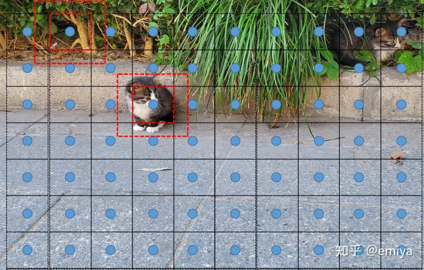
## Anchor-Based
1. 錨點（Anchors）的概念： 使用預先定義的錨點，這些錨點通常是在不同尺度和長寬比例下的矩形框。模型根據這些錨點進行預測，並調整其位置和形狀以擬合實際目標的位置。

2. 預測過程： 在預測過程中，模型通常會預測目標的類別、邊界框的位置和形狀，並使用錨點來調整預測。
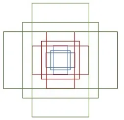

## Anchor-Free
1. 無須錨點： 不使用預定義的錨點，而是直接預測目標的位置，通常使用網格單元（grid cell）或特定點（keypoint）的方式。

2. 預測過程： 模型直接預測目標的位置，而無需進行額外的錨點匹配。這樣可以減少設計上的複雜性。
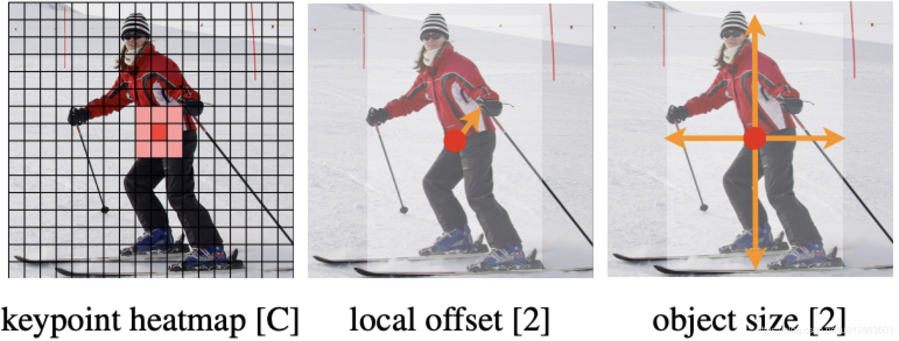
(Center-based methods 先找中心在找到四條邊的距離)

# 任務
## 檢測 (Detect)
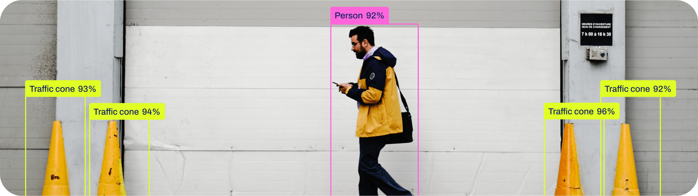
- 目標偵測是一項任務，其目標是辨識影像或視訊串流中物體的位置和類別
- 目標偵測器的輸出包括一組圍繞影像中物體的邊界框（Bounding Boxes）
- 每個邊界框都帶有相應的類別標籤和置信度得分
- 在此任務中，不一定需要準確了解物體的確切形狀，而僅需知道其位置和類別

# 分割 (Segment)
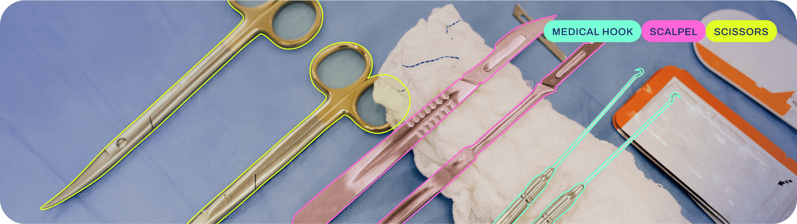

- 更進一步地涉及識別影像中的個別物體，並將它們從影像的其餘部分中精確分割出來
- 實例分割在當您不僅需要知道物體的位置，還需要知道它們確切形狀

# 分類 (Classify)
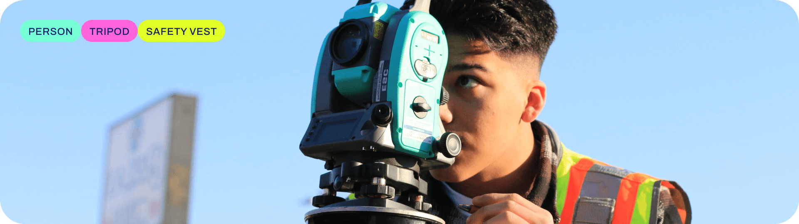
- 目標是將整個影像分類為一組預定義類別中的一個
- 影像分類器的輸出包括單一的類別標籤和一個置信度分數。
- 不需要知道物體的具體位置或形狀，僅需對整個影像進行整體分類的應用場景

# 姿態 (Pose)
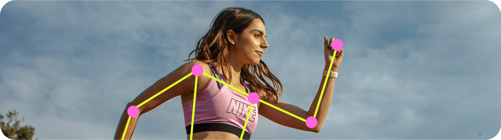
- 其目標是識別影像中特定點的位置，通常被稱為關鍵點。這些關鍵點可以代表物體的各種部位，如關節、地標或其他顯著特徵
- 關鍵點表示 : 2D [x, y] 或3D [x, y, visible]
- 應用於動作識別、人體姿勢分析

Usage
===
# 環境
## 本地
```pip install ultralytics```
## Doker
```
docker run -it --ipc=host --gpus all -v D:/ultralytics:/usr/src/ultralytics "ultralytics/ultralytics:latest"
```


## Train
```
from ultralytics import YOLO

# 加载一个模型
model = YOLO('yolov8n.yaml')  # 從YAML建立一個新模型
model = YOLO('yolov8n.pt')  # 載入預訓練模型（建議用於訓練）
model = YOLO('yolov8n.yaml').load('yolov8n.pt')  # 從YAML建立並轉移權重

# 訓練模型
results = model.train(data='coco128.yaml', epochs=100, imgsz=640)
```

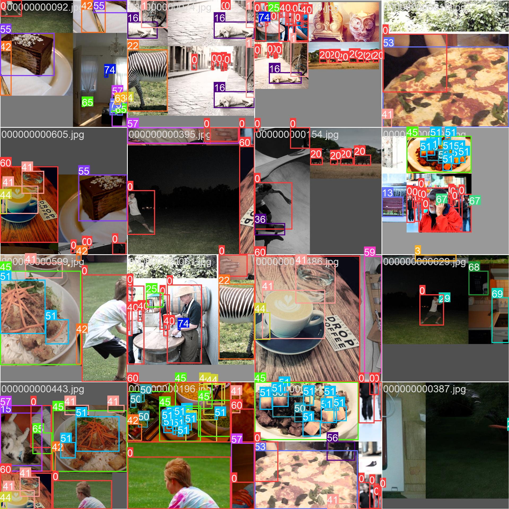
## Fine-tuning
### LabelImg 
Github : <https://github.com/HumanSignal/labelImg>
```
conda install pyqt=5
conda install -c anaconda lxml
pyrcc5 -o libs/resources.py resources.qrc
python labelImg.py
```

修改`labelImg\data`中的`predefined_classes`
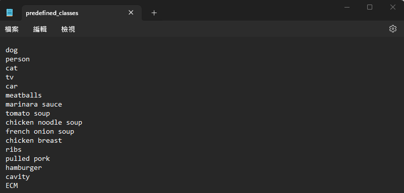

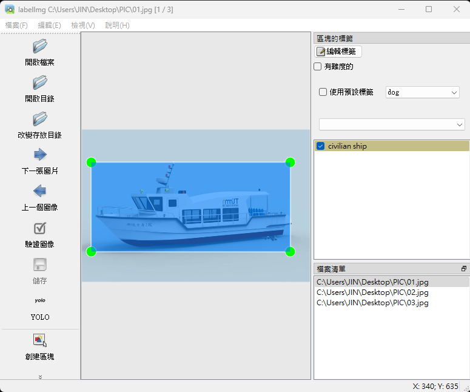


得到`txt`檔
```
16 0.477500 0.508427 0.872500 0.586142
15 0.508125 0.098315 0.108750 0.028090
```

### 開始訓練
```
from ultralytics import YOLO
model = YOLO('yolov8n.yaml').load('yolov8n.pt')
data_path = 'yaml檔位置'
results = model.train(data = data_path, epochs=3, imgsz=640)
```

### 製作`yaml`檔
```
path:'yaml檔位置'
train: images/train
val: images/test
test: images/train

nc: 17  # 類別數量

# 類別名稱
names: ['dog', 'person,'cat','tv','car','meatballs','marinara sauce','tomato soup','chicken noodle soup','french onion soup','chicken breast','ribs','pulled pork','hamburger','cavity','civilian ship']  
```

### 正確放入影像和標籤
```
dataset
└─data
    └─images
        └─train
        └─test
        └─val
    └─labels
        └─train
        └─test
        └─val
```
訓練結束以後，會在runs\detect\train下生成訓練結果
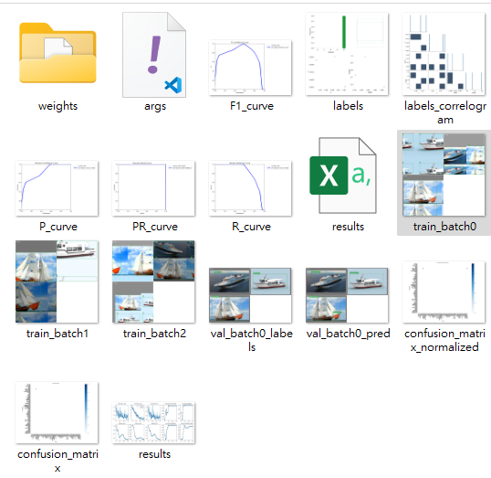
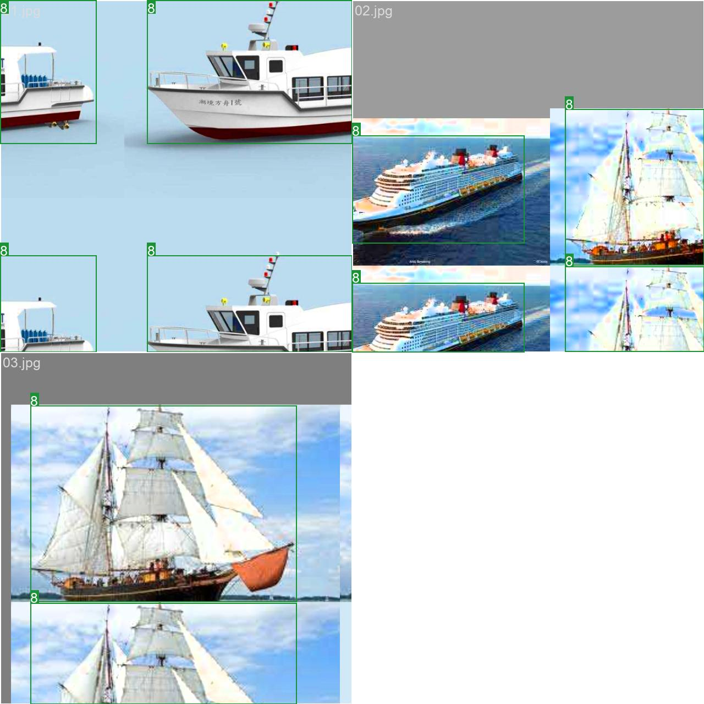
## Predict

### 圖片
```
from ultralytics import YOLO

# 載入預訓練的 YOLOv8n 模型
model = YOLO('yolov8n.pt')

# 定義遠端圖像或視訊 URL
source = 'https://ultralytics.com/images/bus.jpg'

# 對來源進行推理
results = model(source)  # Results 物件列表
```

### 影像
```
# 定義視訊檔案路徑
source = 'path/to/video.mp4'

# 對來源進行推理
results = model(source, stream=True)  # Results 物件的生成器
```
### 實況
```
# 單流媒體源批大小1推理
source = 'rtsp://example.com/media.mp4'  # RTSP、RTMP、TCP或IP流媒体地址

# 多個串流媒體來源的批量推理（例如，8個串流的批次大小為8）
source = 'path/to/list.streams'  # *.streams文本文件，每行一个流媒体地址

# 在源上運行推理
results = model(source, stream=True)  # Results对象的生成器
```
